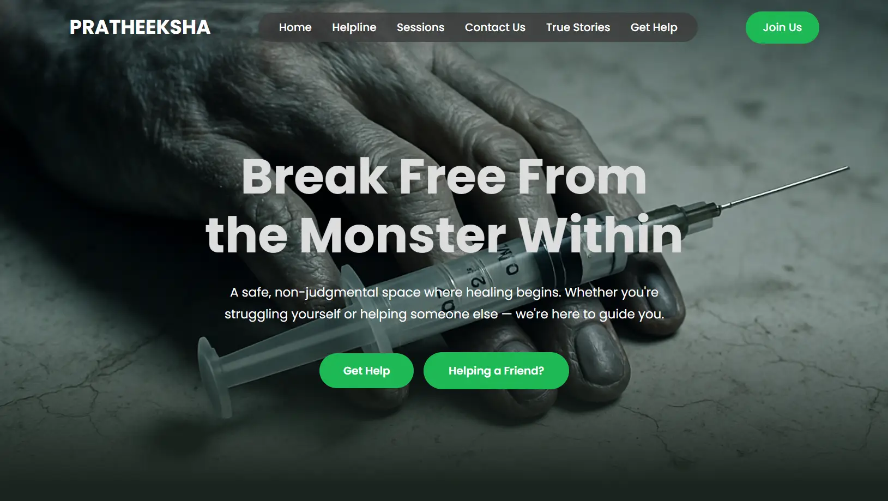

<h1 align="center">🌿 Pratheeksha</h1>
<p align="center">A safe digital space for people battling addiction to seek support and connect anonymously with mentors.</p>

<p align="center">
  <a href="https://pratheeksha.pages.dev/" target="_blank"><strong>🚀 Live Website</strong></a>
</p>

---

## 🌟 About

**Pratheeksha** (meaning *Hope*) is a privacy-first support platform for individuals dealing with substance abuse. It offers an **anonymous chat system** to connect users with verified mentors, giving them the help they need—when they need it.

If no staff is online, the platform gently redirects users to an emergency helpline for immediate assistance.

---

## ✨ Features

- 🔒 **Anonymous live chat** with mentors
- 💬 **Internal staff chat** for team coordination
- 📂 Chats auto-deleted from database after session ends
- 📱 Mobile-friendly, responsive UI

---

## 🛠 Tech Stack

| Frontend | Backend |
|---------|---------|
| HTML/CSS/JS | Firebase |

---

## 📸 Screenshots

> _Visual glimpse of Pratheeksha in action_

<div align="center">




</div>

---

## 🚀 Getting Started (Local Setup)

1. Clone the repo  
   ```bash
   git clone https://github.com/your-username/pratheeksha.git
   ```
2. Open `index.html` in your browser or deploy it to Cloudflare Pages.
3. Add Firebase configuration to `/chat/firebase-config.js` and `/community/script.js` .
4. Deploy Cloudflare Functions for backend logic.

---

## 🤝 Contributors

<table>
  <tr>
    <td align="center">
      <a href="https://karthiksambhur.pages.dev/">
        
        <br /><sub><b>Karthik Sambhu R</b></sub>
      </a>
      <br />
    </td>
    <td align="center">
      <a href="https://github.com/geo-cherian-mathew-2k28">
        
        <br/><sub><b>Geo Cherian Mathew</b></sub>
      </a>
      <br/>
    </td>
  </tr>
</table>

---

> Made with care and compassion ✨
